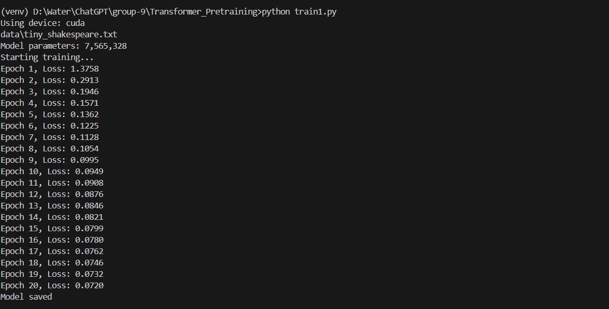
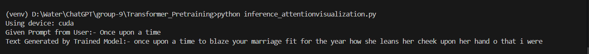
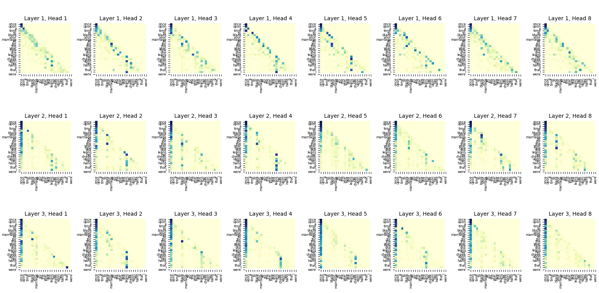

#### Simple Transformer Model

### Overview 
Below is the walkthrough of this Project.

This Simple Transformer model contains hyperparameters as below.

Model Hyperparameters

| Hyperparameter        | Value   | Description                                 |
|-----------------------|---------|---------------------------------------------|
| `vocab_size`          | 10,000 | Number of unique tokens in the vocabulary   |
| `embedding_size`      | 256     | Size of token and position embeddings       |
| `num_layers`          | 3       | Number of Transformer blocks                |
| `num_heads`           | 8       | Number of attention heads per block         |
| `max_sequence_length` | 256     | Maximum length of input sequences           |
| `dropout_rate`        | 0.1     | Dropout rate used in attention and FFN      |

### Project Structure
This project is divided into 5 scripts, each with its own part to play in construction of a Simple Transformer Model

#### 1. data_loader.py

This script automatically downloads Tiny Shakespeare dataset.
Cleans the dataset by removing special characters and normalizing whitespace
Returns cleaned text.

#### 2. tokenizer.py

This script includes a simple text preprocessing and vocabulary management pipeline.
- lowercases the letters
- counts word frequencies to determine most common words
- initializes vocab with <PAD> and <UNK>
- tokenizing (input to lowercase -> extract words)
    - mapping of words to its corresponding token ID via vocab.
    - replace out of vocab words with <UNK> token id.
- detokenizing (id -> word)
- saves vocab as vocab.json and loads vocab

#### 3. Model.py

This script defines a simple transformer
- SimpleTransformerBlock Class defines:
    - LayerNorm before self-attention and feed-forward layers
    - Multi-Head self-attention using nn.MultiheadAttention
    - applies casual mask to prevent tokens from attending future positions.
- Feed-Forward Network:
    - 2 linear layers with GELU activation
    -dropout for regularization
- Resual connections after attention and feed-forward layers

- SimpleTransformer Class:This class composes the full transformer model with

    - Token Embeddings
    - positional embeddings 
    - stack of transformer blocks from SimpleTransformerBlock class
    - Final Layer Normalization before output
    - output linear layer

- Forward Method:
    - Embeds input and position tokens, combines them
    - Attention mask
    - passes input through each transformer block and collects attention weights
    - applies final norm and linear projection to generate logits
    - returns attention weights for interpretability (optional)

#### 4. train.py

This script trains our small transformer model using tokenized text data. Below are its functions:

- Defines hyperparameters(vocab size,embedding dim,no of heads,batch size,learning rate, sequence length and dropout)
- Defines a custom class SimpleTextDataset, to prepare training data from token IDs
- Generates input-output pairs for next token prediction
- train() function loads and preprocesses raw text data using data_loader.
    - loads vocab using functions from tokenizer.py
    - initializes a SimpleTransformer model with provided hyperparameters
    - sets up loss functions (CrossEntropyLoss) and Adam optimizer
- For each epoch:
    - Iterates over mini-batches of input-target token sequences.
    - Performs forward pass, computes loss, backpropagates gradients, and updates model weights.
    - Accumulates and prints average loss per epoch

#### 5. Inference_attentionvisualization.py

This script has following functionality:

- Loads the trained model "small_transformer.pth" and vocab.json
- Encodes user provided prompt
- Generates text using trained tranformer (argmax for next token prediction)
- Detokenizes output
- visualizes attention using heatmaps to display attention weights for each layer and head.
- shows how tokens attend to each other during generation
- plots attention matrices where rows and columns are labelled with tokens, one heatmap per attention head per layer

### Training Process

Model was trained on tiny_shakespeare.txt dataset .

No. of parameters: 7,565,328

Model was trained in 20 epochs , loss function showed consistent decrease throughout the training process , indicating effective learning on data.

final loss stood at 0.0720 , indicating a well trained model. 

Model parameters were successfully saved after training.

### Inference results 

Above is what model generated when provided with prompt "Once upon a time" 

Prompt: Once upon a time
Generated text: "once upon a time to blaze your marriage fit for the year how she leans her cheek upon her hand o that i were"

The generated text shows model's ability to produce grammatically correct and contextually relevant sequence of words.

### Attention visualization:

The visualization provides insights into how the model processes inputs.
    - 3 Layers with 8 attention heads.

Interpretation: Each grid represents how much attention a word in the output sequence pays to words in the input sequence. Darker squares indicate higher attention weights. This helps understand which parts of the input the model focuses on when generating each part of the output.
